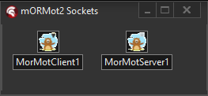

# MorMot Socket Components (WORK IN PROGRESS)

**NetCom7-style socket components for Delphi built on mORMot2's high-performance async framework**

## Overview

<p align="center">
  
</p>

The MorMot Socket Components provide a familiar NetCom7-Sockets-style interface for network communication while leveraging the power and performance of mORMot2's asynchronous socket framework. These components are designed as a drop-in replacement for NetCom7 components, making migration straightforward while gaining significant performance improvements.

### Key Features

- **NetCom7-Compatible API**: Familiar methods, properties, and events for easy migration
- **High Performance**: Built on mORMot2's async socket framework
- **Binary Protocol**: Efficient binary communication with magic markers and structured commands
- **Auto-Reconnection**: Built-in reconnection handling like NetCom7
- **Thread-Safe**: Proper synchronization for multi-threaded applications
- **Command/Response Pattern**: Support for commands that require responses (a sort of blocking mode if you choose to enable it
- **Exception Handling**: Network exceptions are properly propagated

## Components

### TMorMotServer
Server component that accepts incoming connections and handles multiple clients simultaneously.

**Key Properties:**
- `Active`: Start/stop the server
- `Port`: Server listening port (default: 3434)
- `ClientCount`: Number of connected clients (read-only)
- `Reconnect`: Enable automatic reconnection handling

**Key Events:**
- `OnConnect`: Fired when a client connects
- `OnDisconnect`: Fired when a client disconnects
- `OnHandleCommand`: Handle incoming commands from clients
- `OnReconnect`: Fired during reconnection attempts

### TMorMotClient
Client component for connecting to a TMorMotServer.

**Key Properties:**
- `Active`: Connect/disconnect from server
- `Host`: Server hostname or IP address
- `Port`: Server port to connect to
- `Reconnect`: Enable automatic reconnection

**Key Events:**
- `OnConnect`: Fired when connected to server
- `OnDisconnect`: Fired when disconnected from server
- `OnHandleCommand`: Handle incoming commands from server
- `OnReconnect`: Fired during reconnection attempts

## Installation

### Prerequisites
- Delphi XE2 or later (tested with Delphi 11+)
- mORMot2 framework installed and configured
- Windows platform (currently Windows-only)

### Step 1: Download the Components
Download the components from This Github Repository...

### Step 2: Install in Delphi IDE
1. Open `MorMotComponents.dproj` in Delphi
2. compile / build it .... right click on it and click Install
3. Add its output path to your IDE library paths win32\release folder is the one you should add... (Keep in mind if you have mormotV2 sockets installed and thier paths added you may need to REMOVE those paths so the components will not break your intelisense)
4. Reason this happens is because the mormot library paths and the path to these components have some units that conflict with the IDE.... so ensure you keep this in mind if you run into issues it can be very annoying!!!

### Step 3: Add to Library Path
Ensure the component source directory is in your Delphi library path:
1. Go to **Tools** → **Options** → top right search just type library path and click on it
2. Add the component directory to **Library path**

## Quick Start Guide

2 DEMOS ARE INCLUDED for your convinance!

## Advanced Usage

### Sending Commands to Specific Clients (Server-side)

```pascal
procedure TServerForm.SendMessageToClient(Client: TMorMotServerClient; const Msg: string);
var
  Data: TBytes;
begin
  Data := BytesOf(Msg);
  // Send command 2 to specific client, no response needed
  MorMotServer1.ExecCommand(Client, 2, Data, False);
end; Msg: string);
var
  Data: TBytes;
begin
  Data := TEncoding.UTF8.GetBytes(Msg);
  // Send command 2 to specific client, no response needed
  MorMotServer1.ExecCommand(Client, 2, Data, False);
end;

procedure TServerForm.BroadcastMessage(const Msg: string);
var
  Clients: TArray<TMorMotServerClient>;
  Client: TMorMotServerClient;
begin
  Clients := MorMotServer1.Clients;
  for Client in Clients do
    SendMessageToClient(Client, Msg);
end;
```

### Binary Data Communication

```pascal
// Sending binary data (e.g., image, file)
procedure SendBinaryData(const FileName: string);
var
  FileStream: TFileStream;
  Data: TBytes;
begin
  FileStream := TFileStream.Create(FileName, fmOpenRead);
  try
    SetLength(Data, FileStream.Size);
    FileStream.ReadBuffer(Data[0], FileStream.Size);
    
    // Send binary data as command 100
    MorMotClient1.ExecCommand(100, Data, False);
  finally
    FileStream.Free;
  end;
end;
```

### Error Handling

```pascal
function TServerForm.MorMotServer1HandleCommand(Sender: TObject; aCmd: Integer; 
  aData: TBytes; aRequiresResult: Boolean): TBytes;
begin
  try
    case aCmd of
      1: Result := ProcessCommand1(aData);
      2: Result := ProcessCommand2(aData);
      else
        raise Exception.Create('Unknown command: ' + IntToStr(aCmd));
    end;
  except
    on E: Exception do
    begin
      // Exception will be automatically sent back to client if aRequiresResult = True
      raise;
    end;
  end;
end;
```

## Migration from NetCom7

The components are designed to be largely compatible with NetCom7. Key differences:

1. **Component Names**: `TMorMotClient` instead of `TncTCPClient`, `TMorMotServer` instead of `TncTCPServer`
2. **Event Parameters**: Some event parameters have slightly different names but same functionality
3. **Binary Focus**: Optimized for binary data; string methods convert to/from UTF8
4. **Performance**: Significantly better performance due to mORMot2's async framework

The components use a simple binary protocol:

```
Message Structure:
+----------------+----------------+------------------+
| Magic (4 bytes)| Size (4 bytes) | Data (Size bytes)|
+----------------+----------------+------------------+

Command Structure (within Data):
+----------+----------+----------+----------+-------------+
|Type(1 byte)|Cmd(4 bytes)|Requires(1)|DataSize(4)|Command Data|
+----------+----------+----------+----------+-------------+
```

- **Magic**: 0xCAFEBABE (identifies protocol messages)
- **Command Types**: 0x01=Command, 0x02=Result, 0x03=Exception

## Performance Notes

- Built on mORMot2's high-performance async socket framework
- Supports thousands of concurrent connections
- Minimal memory allocation during communication
- Binary protocol reduces parsing overhead
- Thread-safe design for server applications

## Requirements

- **mORMot2**: Latest version recommended
- **Delphi**: XE2 or later (tested with Delphi 11+)
- **Platform**: Windows (32-bit and 64-bit)
- **Framework**: VCL applications, Tested and working with console applications as well just import the units you require and make the events yourself really not hard at all.

## License

Open Source Code as always! free to distribute and use!

## Contributing

Contributions are welcome! Please ASSIST!!!!

## Support

- **Issues**: Report bugs and feature requests via GitHub Issues

## Changelog

**Note**: These components require the mORMot2 framework. Ensure mORMot2 is properly installed and configured in your Delphi environment before using these components.
