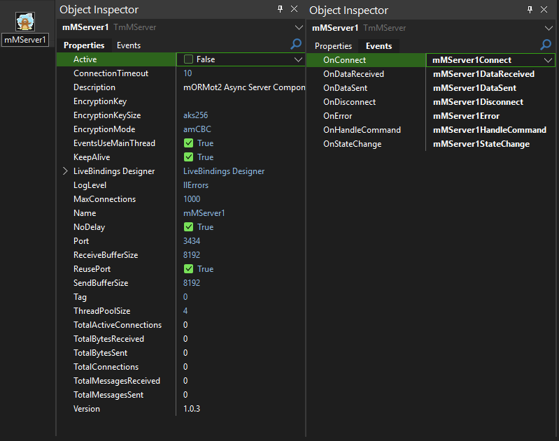

# 🚀 mORMot Socket Components v1.0.3
**High-Performance Async Socket Components for Delphi**

<div align="center">


*"BULLETPROOF Active Connection Counting & BULLETPROOF Reconnection After Force Disconnect"*

</div>

---

## 🎬 Component Preview

<div align="center">

### 🖥️ **Server Component in Action**


### 💻 **Client Component in Action**  


*See the components in action with real-time statistics, connection management, and bulletproof performance!*

</div>

---

## ✨ Why Choose mORMot Socket Components?

### 🎯 **Built for Performance**
- **mORMot2's Async Framework**: Leverages the lightning-fast mORMot2 async socket architecture
- **Thousands of Concurrent Connections**: Handle massive client loads with ease
- **Minimal Memory Allocation**: Optimized for enterprise-grade performance
- **Binary Protocol**: Efficient data transmission with magic markers

### 🔧 **Developer-Friendly**
- **NetCom7-Compatible API**: Drop-in replacement with familiar methods and events
- **Thread-Safe Design**: Bulletproof multi-threaded operation
- **Auto-Reconnection**: Intelligent reconnection strategies with backoff algorithms
- **Per-Message Encryption**: Choose encryption on a per-message basis

### 🛡️ **Enterprise Features**
- **AES Encryption**: Full AES support (ECB, CBC, CFB, OFB, CTR, GCM, CFC, OFC, CTC)
- **Connection Management**: Advanced client management and statistics
- **Robust Error Handling**: Comprehensive error propagation and handling
- **Professional Logging**: Configurable logging levels for debugging and monitoring

---

## 📦 Quick Installation

### 🔨 **3-Step Installation**

1. **Build the Package**
   ```
   Open MorMotComponents.dproj → Build → Install
   ```

2. **Add Library Path**
   ```
   Tools → Options → Library Path → Add source folder path
   ```

3. **Start Building!**
   ```
   Find components in Tool Palette under "mORMot Socket"
   ```

> ⚠️ **Note**: If you have mORMot2 paths in your library, you may need to remove them temporarily to avoid IntelliSense conflicts.

---

## 🏗️ Components Overview

### 🖥️ **TMorMotServer** - Server Component

The powerhouse server component that accepts and manages multiple simultaneous client connections with enterprise-grade performance.

#### 📋 **Key Properties**

| Property | Type | Default | Description |
|----------|------|---------|-------------|
| `Active` | Boolean | False | ⚡ Start/stop the server |
| `Port` | Integer | 3434 | 🔌 Server listening port |
| `MaxConnections` | Integer | 1000 | 👥 Maximum concurrent connections |
| `ThreadPoolSize` | Integer | 4 | 🧵 Async thread pool size |
| `ConnectionTimeout` | Integer | 10 | ⏱️ Connection timeout (seconds) |
| `EventsUseMainThread` | Boolean | True | 🎯 Fire events in main thread |
| `EncryptionKey` | String | "" | 🔐 AES encryption key |
| `EncryptionMode` | TAESMode | amCBC | 🛡️ AES encryption mode |
| `EncryptionKeySize` | TAESKeySize | aks256 | 🔑 Key size (128/192/256) |
| `KeepAlive` | Boolean | True | 💓 TCP keep-alive |
| `NoDelay` | Boolean | True | ⚡ TCP_NODELAY for low latency |

#### 📊 **Statistics Properties (Read-Only)**

| Property | Type | Description |
|----------|------|-------------|
| `ClientCount` | Integer | 👥 Current active connections |
| `TotalConnections` | Int64 | 📈 Total connections since start |
| `TotalActiveConnections` | Int64 | 🔴 Live connection count |
| `TotalBytesReceived` | Int64 | 📥 Total bytes received |
| `TotalBytesSent` | Int64 | 📤 Total bytes sent |
| `UpTime` | Integer | ⏰ Server uptime in seconds |

#### 🎪 **Events**

| Event | Description |
|-------|-------------|
| `OnConnect` | 🎉 Client connected |
| `OnDisconnect` | 👋 Client disconnected |
| `OnHandleCommand` | 📨 Process incoming data |
| `OnError` | ❌ Error occurred |
| `OnStateChange` | 🔄 Server state changed |
| `OnDataSent` | 📤 Data transmission complete |
| `OnDataReceived` | 📥 Data reception complete |

---

### 💻 **TMorMotClient** - Client Component

The intelligent client component with bulletproof auto-reconnection and flexible connection strategies.

#### 📋 **Key Properties**

| Property | Type | Default | Description |
|----------|------|---------|-------------|
| `Active` | Boolean | False | ⚡ Connect/disconnect |
| `Host` | String | "localhost" | 🌐 Server hostname/IP |
| `Port` | Integer | 3434 | 🔌 Server port |
| `ConnectionTimeout` | Integer | 10 | ⏱️ Connection timeout |
| `AutoReconnect` | Boolean | False | 🔄 Enable auto-reconnection |
| `ReconnectStrategy` | TmMReconnectStrategy | rsBackoff | 📈 Reconnection strategy |
| `ReconnectInterval` | Integer | 5000 | ⏰ Base reconnection interval (ms) |
| `ReconnectMaxAttempts` | Integer | 10 | 🔢 Maximum reconnection attempts |
| `EventsUseMainThread` | Boolean | True | 🎯 Fire events in main thread |

#### 🔄 **Reconnection Strategies**

| Strategy | Description |
|----------|-------------|
| `rsNone` | ❌ No automatic reconnection |
| `rsImmediate` | ⚡ Reconnect immediately (100ms) |
| `rsBackoff` | 📈 Exponential backoff (smart) |
| `rsFixedInterval` | ⏰ Fixed interval reconnection |

#### 📊 **Statistics Properties (Read-Only)**

| Property | Type | Description |
|----------|------|-------------|
| `ConnectedTime` | Integer | ⏰ Time connected (seconds) |
| `ReconnectAttempts` | Integer | 🔢 Current reconnection attempts |
| `RemoteIP` | String | 🌐 Server IP address |
| `TotalBytesReceived` | Int64 | 📥 Total bytes received |
| `TotalBytesSent` | Int64 | 📤 Total bytes sent |

#### 🎪 **Events**

| Event | Description |
|-------|-------------|
| `OnConnect` | 🎉 Connected to server |
| `OnDisconnect` | 👋 Disconnected from server |
| `OnHandleCommand` | 📨 Process incoming data |
| `OnError` | ❌ Error occurred |
| `OnStateChange` | 🔄 Connection state changed |

---

## 🚀 Quick Start Examples

### 🖥️ **Basic Server Setup**

```pascal
// 1. Drop TMorMotServer on form
// 2. Configure basic properties
procedure TServerForm.FormCreate(Sender: TObject);
begin
  MorMotServer1.Port := 8080;
  MorMotServer1.MaxConnections := 500;
  MorMotServer1.Active := True;  // Start server
end;

// 3. Handle incoming data
function TServerForm.MorMotServer1HandleCommand(Sender: TObject; 
  Client: TmMServerClient; aData: TBytes): TBytes;
var
  ReceivedText: string;
begin
  // Convert received bytes to string
  ReceivedText := StringOf(aData);
  ShowMessage('Received: ' + ReceivedText);
  
  // Echo back with confirmation
  Result := BytesOf('Echo: ' + ReceivedText);
end;

// 4. Handle client connections
procedure TServerForm.MorMotServer1Connect(Sender: TObject; 
  Client: TmMServerClient);
begin
  Memo1.Lines.Add(Format('Client connected: %s:%d', 
    [Client.PeerIP, Client.PeerPort]));
end;
```

### 💻 **Basic Client Setup**

```pascal
// 1. Drop TMorMotClient on form
// 2. Configure connection
procedure TClientForm.FormCreate(Sender: TObject);
begin
  MorMotClient1.Host := '127.0.0.1';
  MorMotClient1.Port := 8080;
  MorMotClient1.AutoReconnect := True;
  MorMotClient1.ReconnectStrategy := rsBackoff;
end;

// 3. Connect to server
procedure TClientForm.ButtonConnectClick(Sender: TObject);
begin
  MorMotClient1.Active := True;
end;

// 4. Send data
procedure TClientForm.ButtonSendClick(Sender: TObject);
var
  Data: TBytes;
begin
  Data := BytesOf('Hello Server!');
  MorMotClient1.SendData(Data, False);  // Unencrypted
end;

// 5. Handle connection events
procedure TClientForm.MorMotClient1Connect(Sender: TObject);
begin
  ShowMessage('Connected to server!');
end;
```

---

## 🔐 Encryption Examples

### 🛡️ **Server with Encryption**

```pascal
procedure TServerForm.FormCreate(Sender: TObject);
begin
  // Configure encryption
  MorMotServer1.EncryptionKey := 'MySecretKey123!';
  MorMotServer1.EncryptionMode := amCBC;
  MorMotServer1.EncryptionKeySize := aks256;
  MorMotServer1.Active := True;
end;

// Send encrypted response
function TServerForm.MorMotServer1HandleCommand(Sender: TObject; 
  Client: TmMServerClient; aData: TBytes): TBytes;
begin
  // Process data...
  Result := BytesOf('Encrypted response');
  
  // Response will be encrypted automatically if client sent encrypted data
end;

// Send encrypted data to specific client
procedure TServerForm.SendEncryptedMessage(Client: TmMServerClient);
var
  Data: TBytes;
begin
  Data := BytesOf('Secret message');
  Client.SendData(Data, True);  // Encrypted = True
end;
```

### 🔑 **Client with Encryption**

```pascal
procedure TClientForm.FormCreate(Sender: TObject);
begin
  // Must match server encryption settings
  MorMotClient1.EncryptionKey := 'MySecretKey123!';
  MorMotClient1.EncryptionMode := amCBC;
  MorMotClient1.EncryptionKeySize := aks256;
end;

// Send encrypted message
procedure TClientForm.SendEncryptedData;
var
  Data: TBytes;
begin
  Data := BytesOf('Top secret data');
  MorMotClient1.SendData(Data, True);  // Encrypted = True
end;

// Send unencrypted message (mixed mode)
procedure TClientForm.SendPlainData;
var
  Data: TBytes;
begin
  Data := BytesOf('Public data');
  MorMotClient1.SendData(Data, False);  // Encrypted = False
end;
```

---

## 👥 Client Management Examples

### 📋 **Loop Through All Clients**

```pascal
procedure TServerForm.LoopAllClients;
var
  Client: TmMServerClient;
  ClientInfo: string;
begin
  Memo1.Lines.Clear;
  
  // Thread-safe iteration
  MorMotServer1.PropertyLock.Enter;
  try
    for Client in MorMotServer1.Clients.Values do
    begin
      ClientInfo := Format('Handle: %d, IP: %s, Connected: %s, Bytes: %d/%d',
        [Client.Handle, Client.PeerIP, 
         FormatDateTime('hh:nn:ss', Client.ConnectedAt),
         Client.BytesReceived, Client.BytesSent]);
      
      Memo1.Lines.Add(ClientInfo);
    end;
  finally
    MorMotServer1.PropertyLock.Leave;
  end;
  
  Caption := Format('Server - %d clients connected', 
    [MorMotServer1.ClientCount]);
end;
```

### 📤 **Broadcasting Messages**

```pascal
// Broadcast unencrypted message to all clients
procedure TServerForm.BroadcastPlainMessage;
var
  Data: TBytes;
begin
  Data := BytesOf('Broadcast message to all!');
  MorMotServer1.BroadcastData(Data, False);  // Unencrypted
end;

// Broadcast encrypted message to all clients
procedure TServerForm.BroadcastEncryptedMessage;
var
  Data: TBytes;
begin
  Data := BytesOf('Secret broadcast!');
  MorMotServer1.BroadcastData(Data, True);   // Encrypted
end;

// Send to specific client by IP
procedure TServerForm.SendToClientByIP(const IP: string; const Msg: string);
var
  Client: TmMServerClient;
  Data: TBytes;
begin
  Client := MorMotServer1.FindClientByIP(IP);
  if Assigned(Client) then
  begin
    Data := BytesOf(Msg);
    Client.SendData(Data, False);
  end;
end;
```

### 🚫 **Disconnecting Clients**

```pascal
// Disconnect all clients
procedure TServerForm.DisconnectAllClientsClick(Sender: TObject);
begin
  MorMotServer1.DisconnectAllClients;
  ShowMessage('All clients disconnected');
end;

// Disconnect specific client by IP
procedure TServerForm.DisconnectClientByIP(const IP: string);
var
  Client: TmMServerClient;
begin
  Client := MorMotServer1.FindClientByIP(IP);
  if Assigned(Client) then
  begin
    Client.Disconnect;
    ShowMessage('Client ' + IP + ' disconnected');
  end;
end;

// Disconnect client by handle
procedure TServerForm.DisconnectClientByHandle(Handle: TPollAsyncConnectionHandle);
begin
  MorMotServer1.DisconnectClient(Handle);
end;
```

---

## 🔧 Advanced Features

### 📊 **Real-Time Statistics**

```pascal
// Update statistics display
procedure TServerForm.Timer1Timer(Sender: TObject);
begin
  StatusBar1.Panels[0].Text := Format('Clients: %d', [MorMotServer1.ClientCount]);
  StatusBar1.Panels[1].Text := Format('Total Connections: %d', [MorMotServer1.TotalConnections]);
  StatusBar1.Panels[2].Text := Format('Bytes Sent: %d', [MorMotServer1.TotalBytesSent]);
  StatusBar1.Panels[3].Text := Format('Bytes Received: %d', [MorMotServer1.TotalBytesReceived]);
  StatusBar1.Panels[4].Text := Format('Uptime: %d sec', [MorMotServer1.UpTime]);
end;
```

### 🔄 **Smart Reconnection**

```pascal
// Configure bulletproof reconnection
procedure TClientForm.SetupReconnection;
begin
  MorMotClient1.AutoReconnect := True;
  MorMotClient1.ReconnectStrategy := rsBackoff;
  MorMotClient1.ReconnectInterval := 1000;      // 1 second base
  MorMotClient1.ReconnectMaxAttempts := 20;     // 20 attempts
end;

// Manual reconnection reset
procedure TClientForm.ResetReconnectionClick(Sender: TObject);
begin
  MorMotClient1.ResetReconnectionState;
  ShowMessage('Reconnection state reset');
end;

// Handle reconnection events
procedure TClientForm.MorMotClient1Error(Sender: TObject; 
  const Error: string; ErrorCode: Integer);
begin
  if ErrorCode = -99 then  // Max attempts reached
  begin
    ShowMessage('Auto-reconnection disabled after max attempts');
  end
  else
  begin
    Memo1.Lines.Add('Error: ' + Error);
  end;
end;
```

### 🎯 **Event Management**

```pascal
// Configure event threading
procedure TForm1.FormCreate(Sender: TObject);
begin
  // Events fired in main thread (safe for UI updates)
  MorMotServer1.EventsUseMainThread := True;
  
  // Or handle events in background threads (faster)
  // MorMotServer1.EventsUseMainThread := False;
end;

// Handle state changes
procedure TServerForm.MorMotServer1StateChange(Sender: TObject; 
  OldState, NewState: TmMServerState);
const
  StateNames: array[TmMServerState] of string = 
    ('Disconnected', 'Starting', 'Listening', 'Stopping');
begin
  Memo1.Lines.Add(Format('State: %s → %s', 
    [StateNames[OldState], StateNames[NewState]]));
end;
```

---

## 🛠️ Protocol Details

### 📦 **Message Structure**

```
+----------------+----------------+---------------+------------------+
| Magic (4 bytes)| DataSize (4)   | Encrypted (1) | Data (DataSize)  |
+----------------+----------------+---------------+------------------+
| 0xCAFEBABE     | Length of Data | 1=Yes, 0=No   | Actual Data      |
+----------------+----------------+---------------+------------------+
```

### 🔐 **Encryption Modes Available**

| Mode | Description | Use Case |
|------|-------------|----------|
| `amECB` | Electronic Codebook | Simple, fast |
| `amCBC` | Cipher Block Chaining | **Default, secure** |
| `amCFB` | Cipher Feedback | Stream-like |
| `amOFB` | Output Feedback | Stream cipher |
| `amCTR` | Counter Mode | Parallel processing |
| `amGCM` | Galois/Counter Mode | Authenticated encryption |
| `amCFC` | CFC Mode | Advanced |
| `amOFC` | OFC Mode | Advanced |
| `amCTC` | CTC Mode | Advanced |

---

## 🎪 Complete Working Example

### 🖥️ **Echo Server**

```pascal
unit ServerMainForm;

interface

uses
  Winapi.Windows, Winapi.Messages, System.SysUtils, System.Variants, 
  System.Classes, Vcl.Graphics, Vcl.Controls, Vcl.Forms, Vcl.Dialogs,
  Vcl.StdCtrls, Vcl.ExtCtrls, mMServer;

type
  TForm1 = class(TForm)
    MorMotServer1: TMorMotServer;
    Memo1: TMemo;
    Panel1: TPanel;
    ButtonStart: TButton;
    ButtonStop: TButton;
    ButtonDisconnectAll: TButton;
    Timer1: TTimer;
    StatusBar1: TStatusBar;
    
    procedure FormCreate(Sender: TObject);
    procedure ButtonStartClick(Sender: TObject);
    procedure ButtonStopClick(Sender: TObject);
    procedure ButtonDisconnectAllClick(Sender: TObject);
    procedure Timer1Timer(Sender: TObject);
    
    // Server events
    function MorMotServer1HandleCommand(Sender: TObject; 
      Client: TmMServerClient; aData: TBytes): TBytes;
    procedure MorMotServer1Connect(Sender: TObject; Client: TmMServerClient);
    procedure MorMotServer1Disconnect(Sender: TObject; Client: TmMServerClient);
    procedure MorMotServer1Error(Sender: TObject; Client: TmMServerClient; 
      const Error: string; ErrorCode: Integer);
  end;

var
  Form1: TForm1;

implementation

{$R *.dfm}

procedure TForm1.FormCreate(Sender: TObject);
begin
  // Configure server
  MorMotServer1.Port := 8080;
  MorMotServer1.MaxConnections := 1000;
  MorMotServer1.EncryptionKey := 'MySecretKey123!';
  MorMotServer1.EncryptionMode := amCBC;
  
  // Start timer for statistics
  Timer1.Interval := 1000;
  Timer1.Enabled := True;
  
  Memo1.Lines.Add('Echo Server Ready - Click Start to begin');
end;

procedure TForm1.ButtonStartClick(Sender: TObject);
begin
  MorMotServer1.Active := True;
  Memo1.Lines.Add('Server started on port ' + IntToStr(MorMotServer1.Port));
end;

procedure TForm1.ButtonStopClick(Sender: TObject);
begin
  MorMotServer1.Active := False;
  Memo1.Lines.Add('Server stopped');
end;

procedure TForm1.ButtonDisconnectAllClick(Sender: TObject);
begin
  MorMotServer1.DisconnectAllClients;
  Memo1.Lines.Add('All clients disconnected');
end;

function TForm1.MorMotServer1HandleCommand(Sender: TObject; 
  Client: TmMServerClient; aData: TBytes): TBytes;
var
  ReceivedText: string;
  Response: string;
begin
  ReceivedText := StringOf(aData);
  Response := 'Echo: ' + ReceivedText;
  
  Memo1.Lines.Add(Format('[%s] %s', [Client.PeerIP, ReceivedText]));
  
  // Return echo response
  Result := BytesOf(Response);
end;

procedure TForm1.MorMotServer1Connect(Sender: TObject; Client: TmMServerClient);
begin
  Memo1.Lines.Add(Format('✅ Client connected: %s:%d (Handle: %d)', 
    [Client.PeerIP, Client.PeerPort, Client.Handle]));
end;

procedure TForm1.MorMotServer1Disconnect(Sender: TObject; Client: TmMServerClient);
begin
  Memo1.Lines.Add(Format('❌ Client disconnected: %s (Handle: %d)', 
    [Client.PeerIP, Client.Handle]));
end;

procedure TForm1.MorMotServer1Error(Sender: TObject; Client: TmMServerClient; 
  const Error: string; ErrorCode: Integer);
begin
  if Assigned(Client) then
    Memo1.Lines.Add(Format('⚠️ Error [%s]: %s', [Client.PeerIP, Error]))
  else
    Memo1.Lines.Add('⚠️ Server Error: ' + Error);
end;

procedure TForm1.Timer1Timer(Sender: TObject);
begin
  Caption := Format('Echo Server - %d clients, %d total connections', 
    [MorMotServer1.ClientCount, MorMotServer1.TotalConnections]);
end;

end.
```

---

## 🏆 Performance & Compatibility

### ⚡ **Performance Specs**
- **Concurrent Connections**: 1000+ simultaneous clients
- **Throughput**: Optimized binary protocol with minimal overhead
- **Memory Usage**: Efficient memory management with object pooling
- **CPU Usage**: Multi-threaded async architecture for maximum performance

### 🔧 **Compatibility**
- **Delphi Versions**: XE2, XE3, XE4, XE5, XE6, XE7, XE8, 10 Seattle, 10.1 Berlin, 10.2 Tokyo, 10.3 Rio, 10.4 Sydney, 11 Alexandria, 12 Athens, 12.2
- **Platforms**: Windows 32-bit & 64-bit
- **Frameworks**: VCL, Console applications
- **Dependencies**: mORMot2 framework (included)

### 📋 **Requirements**
- ✅ mORMot2 framework properly installed
- ✅ Windows platform (32/64-bit)
- ✅ Delphi XE2 or later

---

## 🎯 **Why v1.0.3 is Special**

### 🛡️ **BULLETPROOF Features**
- **Active Connection Counting**: Foolproof live connection tracking using dictionary count
- **Force Disconnect Recovery**: Aggressive reconnection strategies for network interruptions
- **Memory Leak Prevention**: Centralized cleanup procedures prevent resource leaks
- **Thread-Safe Operations**: All operations properly synchronized for multi-threaded safety

### 🆕 **Version 1.0.3 Improvements**
- ✅ Fixed RemoteIP property to properly capture client/server IPs
- ✅ Enhanced reconnection timer with minimum intervals
- ✅ Bulletproof client disconnect handling
- ✅ Live connection count using dictionary instead of manual counters
- ✅ Improved error handling and event management
- ✅ Enhanced encryption context management

---

## 📞 **Support & Community**

### 💬 **Get Help**
- **Issues**: Report bugs via GitHub Issues
- **Questions**: Community support available
- **Contributing**: Pull requests welcome!

### 📜 **License**
**Open Source** - Free to distribute and use in commercial and personal projects!

---

<div align="center">

**🚀 Ready to Build High-Performance Socket Applications?**

*Download • Install • Build Amazing Apps!*

**Made By BitmasterXor And Friends With ❤️ for the Delphi Community**

</div>
